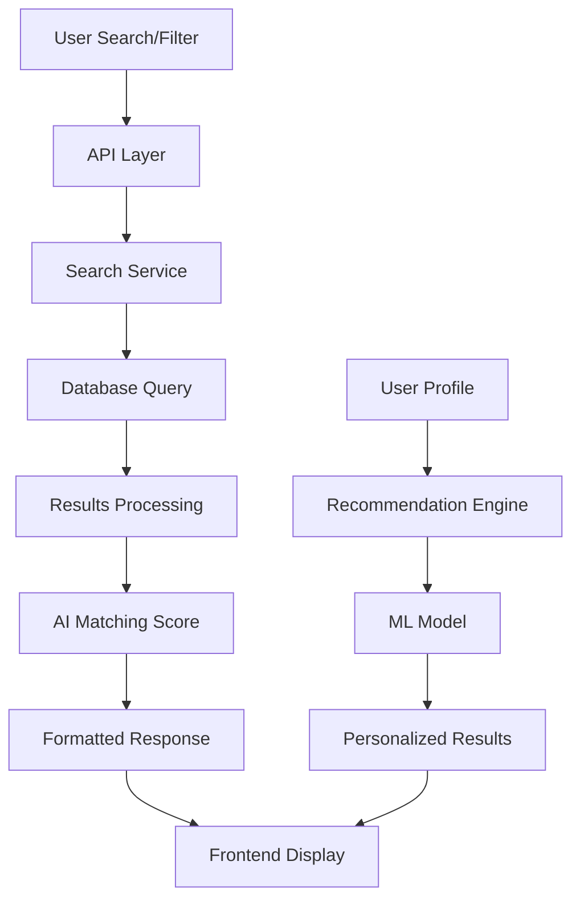

# Design Document

## Overview

The Grant Discovery & Matching System provides intelligent grant search, filtering, and recommendation capabilities for Benefitiary users. Built as a comprehensive search and discovery platform, it leverages the scraped grants database, user profiles, and AI-powered matching algorithms to deliver personalized grant discovery experiences. The system supports different user roles (seekers, writers, funders) with tailored interfaces and features while maintaining high performance and accessibility standards.

## Architecture

### High-Level System Architecture
```
Frontend (Next.js) ↔ API Layer ↔ Matching Engine ↔ Database (Neon)
                                      ↓
                              AI Recommendation Service
                                      ↓
                              Search Index (Elasticsearch/Algolia)
```

### Component Hierarchy
```
app/
├── grants/
│   ├── page.tsx (Grant Explorer)
│   ├── [id]/page.tsx (Grant Details)
│   └── saved/page.tsx (Saved Grants)
├── dashboard/
│   ├── seeker/
│   │   └── recommendations/page.tsx
│   ├── writer/
│   │   └── trending-grants/page.tsx
│   └── funder/
│       └── analytics/page.tsx
└── api/
    ├── grants/
    │   ├── search/route.ts
    │   ├── recommendations/route.ts
    │   └── [id]/route.ts
    └── user/
        ├── saved-grants/route.ts
        └── applications/route.ts
```

### Data Flow Architecture


## Components and Interfaces

### Core Components

#### GrantExplorer Component
```typescript
interface GrantExplorerProps {
  initialGrants: Grant[];
  userProfile: UserProfile;
  totalCount: number;
  currentPage: number;
}

interface Grant {
  id: string;
  title: string;
  description: string;
  funder: Funder;
  category: GrantCategory[];
  deadline?: Date;
  fundingAmountMin?: number;
  fundingAmountMax?: number;
  locationEligibility: string[];
  eligibilityScore?: number;
  matchScore?: number;
  sourceUrl: string;
  scrapedAt: Date;
}

interface Funder {
  id: string;
  name: string;
  type: 'private_foundation' | 'government' | 'ngo' | 'corporate';
  website?: string;
  contactEmail?: string;
}
```

#### SearchAndFilter Component
```typescript
interface SearchFilterProps {
  onSearch: (query: string) => void;
  onFilterChange: (filters: GrantFilters) => void;
  currentFilters: GrantFilters;
  availableFilters: FilterOptions;
}

interface GrantFilters {
  categories: string[];
  deadlineRange: {
    start?: Date;
    end?: Date;
    preset?: 'week' | 'month' | 'quarter';
  };
  fundingRange: {
    min?: number;
    max?: number;
  };
  funderTypes: string[];
  locationEligibility: string[];
}

interface FilterOptions {
  categories: CategoryOption[];
  funderTypes: FunderTypeOption[];
  locations: LocationOption[];
  fundingRanges: FundingRangeOption[];
}
```

#### GrantCard Component
```typescript
interface GrantCardProps {
  grant: Grant;
  userRole: 'seeker' | 'writer' | 'funder';
  isSaved: boolean;
  applicationStatus?: ApplicationStatus;
  onSave: (grantId: string) => Promise<void>;
  onStatusUpdate: (grantId: string, status: ApplicationStatus) => Promise<void>;
  showMatchScore: boolean;
}

interface ApplicationStatus {
  status: 'saved' | 'planning' | 'applied' | 'won' | 'lost';
  updatedAt: Date;
  notes?: string;
}
```

#### RecommendationEngine Component
```typescript
interface RecommendationEngineProps {
  userId: string;
  userProfile: UserProfile;
  limit: number;
  excludeApplied: boolean;
}

interface Recommendation {
  grant: Grant;
  matchScore: number;
  matchReasons: MatchReason[];
  urgencyScore: number;
}

interface MatchReason {
  type: 'category' | 'location' | 'funding_size' | 'org_type' | 'deadline';
  description: string;
  weight: number;
}
```

#### GrantDetails Component
```typescript
interface GrantDetailsProps {
  grant: Grant;
  userProfile: UserProfile;
  eligibilityAssessment: EligibilityAssessment;
  similarGrants: Grant[];
}

interface EligibilityAssessment {
  overallScore: number;
  criteria: EligibilityCriterion[];
  recommendations: string[];
  blockers: string[];
}

interface EligibilityCriterion {
  name: string;
  required: boolean;
  met: boolean;
  description: string;
  userValue?: string;
  requiredValue?: string;
}
```

### API Interfaces

#### Search API
```typescript
// GET /api/grants/search
interface GrantSearchRequest {
  query?: string;
  filters: GrantFilters;
  page: number;
  limit: number;
  sortBy: 'relevance' | 'deadline' | 'funding_amount' | 'match_score';
  sortOrder: 'asc' | 'desc';
}

interface GrantSearchResponse {
  grants: Grant[];
  totalCount: number;
  currentPage: number;
  totalPages: number;
  facets: SearchFacets;
  suggestions?: string[];
}

interface SearchFacets {
  categories: FacetCount[];
  funderTypes: FacetCount[];
  fundingRanges: FacetCount[];
  deadlines: FacetCount[];
}
```

#### Recommendations API
```typescript
// GET /api/grants/recommendations
interface RecommendationRequest {
  userId: string;
  limit: number;
  excludeCategories?: string[];
  minMatchScore?: number;
}

interface RecommendationResponse {
  recommendations: Recommendation[];
  totalAvailable: number;
  lastUpdated: Date;
  nextUpdateAt: Date;
}
```

#### User Actions API
```typescript
// POST /api/user/saved-grants
interface SaveGrantRequest {
  grantId: string;
  notes?: string;
}

// PATCH /api/user/applications/{grantId}
interface UpdateApplicationRequest {
  status: ApplicationStatus['status'];
  notes?: string;
  submissionDate?: Date;
  resultDate?: Date;
}
```

## Data Models

### Enhanced Database Schema

#### Grant Matches Table (for recommendations)
```sql
CREATE TABLE grant_matches (
    id UUID PRIMARY KEY DEFAULT gen_random_uuid(),
    user_id UUID REFERENCES users(id) ON DELETE CASCADE,
    grant_id UUID REFERENCES grants(id) ON DELETE CASCADE,
    match_score INTEGER CHECK (match_score >= 0 AND match_score <= 100),
    match_reasons JSONB,
    status TEXT CHECK (status IN ('saved','planning','applied','won','lost')) DEFAULT 'saved',
    notes TEXT,
    created_at TIMESTAMP DEFAULT NOW(),
    updated_at TIMESTAMP DEFAULT NOW(),
    UNIQUE(user_id, grant_id)
);
```

#### Search Analytics Table
```sql
CREATE TABLE search_analytics (
    id UUID PRIMARY KEY DEFAULT gen_random_uuid(),
    user_id UUID REFERENCES users(id) ON DELETE SET NULL,
    search_query TEXT,
    filters_applied JSONB,
    results_count INTEGER,
    clicked_grants UUID[],
    session_id TEXT,
    created_at TIMESTAMP DEFAULT NOW()
);
```

#### Grant Views Table
```sql
CREATE TABLE grant_views (
    id UUID PRIMARY KEY DEFAULT gen_random_uuid(),
    grant_id UUID REFERENCES grants(id) ON DELETE CASCADE,
    user_id UUID REFERENCES users(id) ON DELETE SET NULL,
    view_duration INTEGER, -- seconds
    source TEXT CHECK (source IN ('search','recommendation','direct','saved')),
    created_at TIMESTAMP DEFAULT NOW()
);
```

### Matching Algorithm Data Structures
```typescript
interface MatchingCriteria {
  categoryMatch: {
    weight: number;
    userCategories: string[];
    grantCategories: string[];
  };
  locationMatch: {
    weight: number;
    userLocation: Location;
    grantEligibility: string[];
  };
  organizationMatch: {
    weight: number;
    userOrgType: string;
    userOrgSize: string;
    grantRequirements: OrganizationRequirements;
  };
  fundingMatch: {
    weight: number;
    grantAmount: FundingRange;
    organizationNeed?: number;
  };
  deadlineUrgency: {
    weight: number;
    deadline: Date;
    currentDate: Date;
  };
}
```

## Error Handling

### Search Error Handling
```typescript
interface SearchError {
  type: 'INVALID_QUERY' | 'TIMEOUT' | 'INDEX_ERROR' | 'RATE_LIMIT';
  message: string;
  suggestions?: string[];
  retryAfter?: number;
}

// Client-side error recovery
class SearchErrorBoundary extends React.Component {
  // Handle search timeouts with retry mechanism
  // Provide fallback search suggestions
  // Log search errors for analysis
}
```

### Recommendation Engine Error Handling
- **Model Failures**: Fallback to rule-based matching
- **Data Inconsistency**: Validate user profiles before matching
- **Performance Issues**: Implement caching and background processing
- **Empty Results**: Provide alternative suggestions and profile updates

### API Rate Limiting
```typescript
// Rate limiting configuration
const rateLimits = {
  search: { requests: 100, window: '15m' },
  recommendations: { requests: 20, window: '1h' },
  saveGrant: { requests: 50, window: '1h' }
};
```

## Testing Strategy

### Unit Testing
- **Search Components**: Test filtering, sorting, and pagination logic
- **Matching Algorithm**: Test scoring calculations and edge cases
- **Form Validation**: Test search input validation and filter combinations
- **API Endpoints**: Mock database responses and test business logic

### Integration Testing
- **Search Flow**: End-to-end search with filters and pagination
- **Recommendation Generation**: Test with various user profiles
- **Database Operations**: Test grant saving, status updates, and analytics
- **External Services**: Mock search index and AI service responses

### Performance Testing
- **Search Response Time**: Target <500ms for search queries
- **Recommendation Generation**: Target <2s for personalized recommendations
- **Database Queries**: Optimize complex filtering and sorting queries
- **Concurrent Users**: Test system under realistic load conditions

### A/B Testing Framework
- **Recommendation Algorithms**: Test different matching strategies
- **UI Layouts**: Test different grant card designs and layouts
- **Search Features**: Test autocomplete vs. manual search effectiveness
- **Filter UX**: Test different filter organization and presentation

## UI/UX Design Specifications

### Search Interface Design
- **Search Bar**: Prominent placement with autocomplete suggestions
- **Filter Panel**: Collapsible sidebar with clear filter categories
- **Results Grid**: Responsive card layout with consistent spacing
- **Pagination**: Load more button or infinite scroll based on user preference

### Grant Card Design
```typescript
interface GrantCardLayout {
  header: {
    title: string;
    funder: string;
    matchScore?: number;
  };
  body: {
    description: string; // truncated to 150 characters
    categories: string[];
    deadline?: Date;
    fundingRange?: string;
  };
  footer: {
    actions: ActionButton[];
    status?: ApplicationStatus;
  };
}
```

### Responsive Breakpoints
- **Mobile (320-768px)**: Single column, stacked filters
- **Tablet (768-1024px)**: Two column grid, sidebar filters
- **Desktop (1024px+)**: Three column grid, persistent filter sidebar

### Accessibility Features
- **Keyboard Navigation**: Full keyboard support for all interactions
- **Screen Reader**: Semantic markup and ARIA labels for complex components
- **Focus Management**: Clear focus indicators and logical tab order
- **Color Contrast**: WCAG AA compliance for all text and interactive elements

## Performance Optimization

### Search Performance
- **Database Indexing**: Composite indexes on frequently filtered columns
- **Search Index**: Elasticsearch or Algolia for full-text search
- **Caching Strategy**: Redis cache for popular searches and filters
- **Query Optimization**: Efficient pagination and result limiting

### Recommendation Performance
- **Background Processing**: Generate recommendations asynchronously
- **Caching**: Cache user recommendations with TTL based on profile changes
- **Batch Processing**: Update recommendations for multiple users efficiently
- **Model Optimization**: Optimize ML model inference time

### Frontend Performance
- **Code Splitting**: Lazy load grant details and advanced features
- **Image Optimization**: Optimize funder logos and grant images
- **Virtual Scrolling**: Handle large result sets efficiently
- **Debounced Search**: Prevent excessive API calls during typing

## Security and Privacy

### Data Protection
- **Search Privacy**: Don't log sensitive search queries
- **User Tracking**: Anonymize analytics data after processing
- **Grant Access**: Ensure users only see grants they're eligible for
- **Rate Limiting**: Prevent scraping and abuse of search endpoints

### API Security
- **Authentication**: Require valid session for personalized features
- **Input Validation**: Sanitize all search queries and filter inputs
- **SQL Injection**: Use parameterized queries and ORM protection
- **CORS Configuration**: Restrict API access to authorized domains