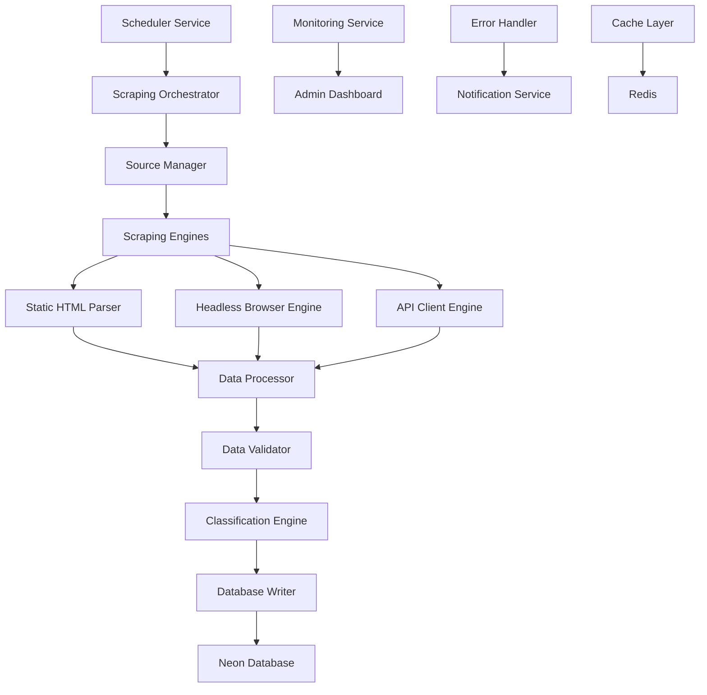
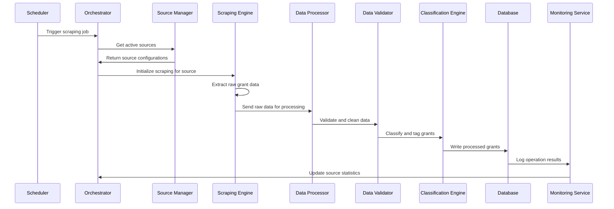

# Design Document

## Overview

The Grant Scraping Implementation system is a robust, scalable web scraping infrastructure designed to automatically collect grant opportunities from diverse funding sources. The system employs multiple scraping strategies (static HTML parsing, headless browser automation, API integration) to handle different website architectures while maintaining high data quality and avoiding detection. Built with Node.js and integrated with the existing Prisma database schema, the system provides comprehensive monitoring, error handling, and data validation capabilities.

## Architecture

### High-Level System Architecture


### Component Architecture
```
src/lib/scraping/
├── core/
│   ├── scheduler.ts          # Job scheduling and orchestration
│   ├── orchestrator.ts       # Main scraping coordinator
│   └── source-manager.ts     # Source configuration management
├── engines/
│   ├── static-parser.ts      # Cheerio-based HTML parsing
│   ├── browser-engine.ts     # Playwright headless browser
│   ├── api-client.ts         # REST/GraphQL API handling
│   └── pdf-processor.ts      # PDF document processing
├── processors/
│   ├── data-processor.ts     # Raw data transformation
│   ├── validator.ts          # Data validation and cleaning
│   ├── classifier.ts         # AI-powered grant classification
│   └── deduplicator.ts       # Duplicate detection and merging
├── sources/
│   ├── foundations/
│   │   ├── gates-foundation.ts
│   │   ├── ford-foundation.ts
│   │   └── rockefeller-foundation.ts
│   ├── government/
│   │   ├── grants-gov.ts
│   │   ├── nih-grants.ts
│   │   └── nsf-grants.ts
│   └── international/
│       ├── global-giving.ts
│       └── world-bank.ts
├── utils/
│   ├── http-client.ts        # HTTP client with proxy/retry logic
│   ├── content-hasher.ts     # Content change detection
│   ├── rate-limiter.ts       # Request rate limiting
│   └── stealth-browser.ts    # Anti-detection measures
└── monitoring/
    ├── metrics-collector.ts  # Performance and success metrics
    ├── error-tracker.ts      # Error logging and analysis
    └── notification-sender.ts # Admin alerts and notifications
```

### Data Flow Architecture


## Components and Interfaces

### Core Scraping Components

#### Scheduler Service
```typescript
interface SchedulerConfig {
  defaultFrequency: ScrapingFrequency;
  maxConcurrentJobs: number;
  retryAttempts: number;
  healthCheckInterval: number;
}

interface ScrapeJob {
  id: string;
  sourceId: string;
  scheduledAt: Date;
  startedAt?: Date;
  finishedAt?: Date;
  status: ScrapeJobStatus;
  priority: number;
  metadata: Record<string, any>;
}

class SchedulerService {
  async scheduleJob(sourceId: string, priority?: number): Promise<ScrapeJob>;
  async getNextJob(): Promise<ScrapeJob | null>;
  async updateJobStatus(jobId: string, status: ScrapeJobStatus): Promise<void>;
  async rescheduleFailedJobs(): Promise<void>;
}
```

#### Scraping Orchestrator
```typescript
interface ScrapingResult {
  sourceId: string;
  totalFound: number;
  totalInserted: number;
  totalUpdated: number;
  totalSkipped: number;
  errors: ScrapingError[];
  duration: number;
  metadata: Record<string, any>;
}

interface ScrapingError {
  type: 'NETWORK' | 'PARSING' | 'VALIDATION' | 'DATABASE';
  message: string;
  url?: string;
  stack?: string;
  timestamp: Date;
}

class ScrapingOrchestrator {
  async executeScrapeJob(job: ScrapeJob): Promise<ScrapingResult>;
  async processSource(source: ScrapedSource): Promise<ScrapingResult>;
  private async handleErrors(errors: ScrapingError[]): Promise<void>;
}
```

#### Source Manager
```typescript
interface SourceConfiguration {
  id: string;
  url: string;
  type: ScrapedSourceType;
  engine: 'static' | 'browser' | 'api';
  selectors: SourceSelectors;
  rateLimit: RateLimitConfig;
  headers: Record<string, string>;
  authentication?: AuthConfig;
  customLogic?: string; // Path to custom scraping logic
}

interface SourceSelectors {
  grantContainer: string;
  title: string;
  description: string;
  deadline: string;
  fundingAmount: string;
  eligibility: string;
  applicationUrl: string;
  funderInfo: string;
}

interface RateLimitConfig {
  requestsPerMinute: number;
  delayBetweenRequests: number;
  respectRobotsTxt: boolean;
}

class SourceManager {
  async getActiveSource(sourceId: string): Promise<SourceConfiguration>;
  async updateSourceMetrics(sourceId: string, metrics: SourceMetrics): Promise<void>;
  async validateSourceConfiguration(config: SourceConfiguration): Promise<boolean>;
}
```

### Scraping Engine Implementations

#### Static HTML Parser Engine
```typescript
interface StaticParserConfig {
  timeout: number;
  retries: number;
  userAgent: string;
  followRedirects: boolean;
}

class StaticParserEngine implements ScrapingEngine {
  async scrape(source: SourceConfiguration): Promise<RawGrantData[]>;
  private async fetchPage(url: string): Promise<CheerioAPI>;
  private async extractGrants($: CheerioAPI, selectors: SourceSelectors): Promise<RawGrantData[]>;
  private async parseGrantElement($element: Cheerio<Element>, selectors: SourceSelectors): Promise<RawGrantData>;
}
```

#### Headless Browser Engine
```typescript
interface BrowserEngineConfig {
  headless: boolean;
  viewport: { width: number; height: number };
  timeout: number;
  waitForSelector: string;
  blockResources: string[]; // Block images, fonts, etc. for performance
  stealthMode: boolean;
}

class BrowserEngine implements ScrapingEngine {
  private browser: Browser;
  
  async scrape(source: SourceConfiguration): Promise<RawGrantData[]>;
  private async navigateToPage(url: string): Promise<Page>;
  private async waitForContent(page: Page, selector: string): Promise<void>;
  private async extractGrantsFromPage(page: Page, selectors: SourceSelectors): Promise<RawGrantData[]>;
  private async handleJavaScriptRendering(page: Page): Promise<void>;
}
```

#### API Client Engine
```typescript
interface APIClientConfig {
  baseUrl: string;
  authentication: AuthConfig;
  rateLimit: RateLimitConfig;
  responseFormat: 'json' | 'xml' | 'csv';
  pagination: PaginationConfig;
}

interface AuthConfig {
  type: 'bearer' | 'basic' | 'apikey' | 'oauth2';
  credentials: Record<string, string>;
}

interface PaginationConfig {
  type: 'offset' | 'cursor' | 'page';
  pageSize: number;
  maxPages: number;
}

class APIClientEngine implements ScrapingEngine {
  async scrape(source: SourceConfiguration): Promise<RawGrantData[]>;
  private async authenticateRequest(): Promise<string>;
  private async fetchPaginatedData(endpoint: string): Promise<any[]>;
  private async transformAPIResponse(data: any[]): Promise<RawGrantData[]>;
}
```

### Data Processing Components

#### Data Processor
```typescript
interface RawGrantData {
  title: string;
  description?: string;
  deadline?: string;
  fundingAmount?: string;
  eligibility?: string;
  applicationUrl?: string;
  funderName?: string;
  sourceUrl: string;
  scrapedAt: Date;
  rawContent: Record<string, any>;
}

interface ProcessedGrantData {
  title: string;
  description: string;
  deadline?: Date;
  fundingAmountMin?: number;
  fundingAmountMax?: number;
  eligibilityCriteria: string;
  applicationUrl?: string;
  funder: FunderData;
  category: GrantCategory;
  locationEligibility: string[];
  confidenceScore: number;
  contentHash: string;
}

class DataProcessor {
  async processRawData(rawData: RawGrantData[]): Promise<ProcessedGrantData[]>;
  private async normalizeText(text: string): Promise<string>;
  private async parseFundingAmount(amount: string): Promise<{ min?: number; max?: number }>;
  private async parseDeadline(deadline: string): Promise<Date | null>;
  private async extractLocationEligibility(text: string): Promise<string[]>;
}
```

#### Data Validator
```typescript
interface ValidationRule {
  field: string;
  required: boolean;
  type: 'string' | 'number' | 'date' | 'url' | 'email';
  minLength?: number;
  maxLength?: number;
  pattern?: RegExp;
  customValidator?: (value: any) => boolean;
}

interface ValidationResult {
  isValid: boolean;
  errors: ValidationError[];
  warnings: ValidationWarning[];
  qualityScore: number;
}

interface ValidationError {
  field: string;
  message: string;
  severity: 'error' | 'warning';
}

class DataValidator {
  private validationRules: ValidationRule[];
  
  async validateGrant(grant: ProcessedGrantData): Promise<ValidationResult>;
  private async validateField(field: string, value: any, rule: ValidationRule): Promise<ValidationError[]>;
  private async calculateQualityScore(grant: ProcessedGrantData): Promise<number>;
}
```

#### Classification Engine
```typescript
interface ClassificationResult {
  category: GrantCategory;
  tags: string[];
  confidence: number;
  reasoning: string[];
}

interface ClassificationModel {
  name: string;
  version: string;
  accuracy: number;
  lastTrained: Date;
}

class ClassificationEngine {
  private models: Map<string, ClassificationModel>;
  
  async classifyGrant(grant: ProcessedGrantData): Promise<ClassificationResult>;
  private async extractKeywords(text: string): Promise<string[]>;
  private async applyRuleBasedClassification(grant: ProcessedGrantData): Promise<ClassificationResult>;
  private async applyMLClassification(grant: ProcessedGrantData): Promise<ClassificationResult>;
  private async generateTags(grant: ProcessedGrantData): Promise<string[]>;
}
```

### Source-Specific Implementations

#### Gates Foundation Scraper
```typescript
class GatesFoundationScraper extends BaseSourceScraper {
  protected sourceConfig: SourceConfiguration = {
    id: 'gates-foundation',
    url: 'https://www.gatesfoundation.org/about/committed-grants',
    type: 'FOUNDATION',
    engine: 'browser',
    selectors: {
      grantContainer: '.grant-item',
      title: '.grant-title',
      description: '.grant-description',
      deadline: '.application-deadline',
      fundingAmount: '.funding-amount',
      eligibility: '.eligibility-criteria',
      applicationUrl: '.apply-link',
      funderInfo: '.funder-details'
    },
    rateLimit: {
      requestsPerMinute: 10,
      delayBetweenRequests: 6000,
      respectRobotsTxt: true
    }
  };

  async customProcessing(rawData: RawGrantData[]): Promise<RawGrantData[]> {
    // Gates Foundation specific data processing
    return rawData.map(grant => ({
      ...grant,
      category: this.inferCategoryFromDescription(grant.description),
      locationEligibility: this.extractGlobalEligibility(grant.eligibility)
    }));
  }

  private inferCategoryFromDescription(description?: string): GrantCategory {
    // Custom logic for Gates Foundation grant categorization
    if (!description) return GrantCategory.HEALTHCARE_PUBLIC_HEALTH;
    
    const healthKeywords = ['health', 'medical', 'disease', 'vaccine', 'treatment'];
    const educationKeywords = ['education', 'learning', 'school', 'teacher', 'student'];
    
    if (healthKeywords.some(keyword => description.toLowerCase().includes(keyword))) {
      return GrantCategory.HEALTHCARE_PUBLIC_HEALTH;
    }
    
    if (educationKeywords.some(keyword => description.toLowerCase().includes(keyword))) {
      return GrantCategory.EDUCATION_TRAINING;
    }
    
    return GrantCategory.HEALTHCARE_PUBLIC_HEALTH; // Default for Gates Foundation
  }
}
```

#### Grants.gov Scraper
```typescript
class GrantsGovScraper extends BaseSourceScraper {
  protected sourceConfig: SourceConfiguration = {
    id: 'grants-gov',
    url: 'https://www.grants.gov/web/grants/search-grants.html',
    type: 'GOV',
    engine: 'api',
    rateLimit: {
      requestsPerMinute: 30,
      delayBetweenRequests: 2000,
      respectRobotsTxt: true
    }
  };

  async scrape(): Promise<RawGrantData[]> {
    // Use Grants.gov API for structured data access
    const apiEndpoint = 'https://www.grants.gov/grantsws/rest/opportunities/search/';
    const response = await this.apiClient.get(apiEndpoint, {
      params: {
        format: 'json',
        rows: 1000,
        start: 0,
        oppStatus: 'forecasted|posted',
        sortBy: 'openDate|desc'
      }
    });

    return this.transformGrantsGovResponse(response.data);
  }

  private transformGrantsGovResponse(data: any): RawGrantData[] {
    return data.oppHits.map((opportunity: any) => ({
      title: opportunity.oppTitle,
      description: opportunity.oppDescription,
      deadline: opportunity.closeDate,
      fundingAmount: opportunity.awardCeiling,
      eligibility: opportunity.eligibilityCriteria,
      applicationUrl: `https://www.grants.gov/web/grants/view-opportunity.html?oppId=${opportunity.oppId}`,
      funderName: opportunity.agencyName,
      sourceUrl: `https://www.grants.gov/web/grants/view-opportunity.html?oppId=${opportunity.oppId}`,
      scrapedAt: new Date(),
      rawContent: opportunity
    }));
  }
}
```

## Data Models

### Enhanced Database Integration

#### Scraping Metadata Extensions
```typescript
// Extensions to existing Prisma models
interface EnhancedScrapedSource {
  // Existing fields from schema.prisma
  id: string;
  url: string;
  type: ScrapedSourceType;
  lastScrapedAt?: Date;
  frequency: ScrapingFrequency;
  status: ScrapedSourceStatus;
  
  // Enhanced fields for scraping implementation
  configuration: SourceConfiguration;
  metrics: SourceMetrics;
  errorHistory: ScrapingError[];
}

interface SourceMetrics {
  totalScrapes: number;
  successfulScrapes: number;
  failedScrapes: number;
  averageProcessingTime: number;
  averageGrantsFound: number;
  lastSuccessfulScrape?: Date;
  lastError?: string;
  successRate: number;
}
```

#### Content Change Detection
```typescript
interface ContentChangeDetection {
  grantId: string;
  previousHash: string;
  currentHash: string;
  changedFields: string[];
  changeType: 'minor' | 'major' | 'critical';
  detectedAt: Date;
}

class ContentHasher {
  generateHash(grant: ProcessedGrantData): string;
  compareHashes(previous: string, current: string): ContentChangeDetection;
  identifyChangedFields(oldGrant: ProcessedGrantData, newGrant: ProcessedGrantData): string[];
}
```

## Error Handling

### Comprehensive Error Management
```typescript
enum ScrapingErrorType {
  NETWORK_ERROR = 'NETWORK_ERROR',
  PARSING_ERROR = 'PARSING_ERROR',
  VALIDATION_ERROR = 'VALIDATION_ERROR',
  RATE_LIMIT_ERROR = 'RATE_LIMIT_ERROR',
  AUTHENTICATION_ERROR = 'AUTHENTICATION_ERROR',
  CAPTCHA_ERROR = 'CAPTCHA_ERROR',
  CONTENT_CHANGED_ERROR = 'CONTENT_CHANGED_ERROR',
  DATABASE_ERROR = 'DATABASE_ERROR'
}

class ErrorHandler {
  async handleScrapingError(error: ScrapingError, context: ScrapingContext): Promise<ErrorResolution>;
  private async shouldRetry(error: ScrapingError): Promise<boolean>;
  private async calculateBackoffDelay(attemptNumber: number): Promise<number>;
  private async notifyAdministrators(error: ScrapingError): Promise<void>;
}

interface ErrorResolution {
  action: 'retry' | 'skip' | 'manual_review' | 'disable_source';
  delay?: number;
  message: string;
}
```

### Retry and Recovery Mechanisms
```typescript
class RetryManager {
  private maxRetries = 3;
  private baseDelay = 1000; // 1 second
  private maxDelay = 300000; // 5 minutes

  async executeWithRetry<T>(
    operation: () => Promise<T>,
    context: string
  ): Promise<T> {
    let lastError: Error;
    
    for (let attempt = 1; attempt <= this.maxRetries; attempt++) {
      try {
        return await operation();
      } catch (error) {
        lastError = error as Error;
        
        if (attempt === this.maxRetries) {
          throw lastError;
        }
        
        const delay = this.calculateExponentialBackoff(attempt);
        await this.sleep(delay);
      }
    }
    
    throw lastError!;
  }

  private calculateExponentialBackoff(attempt: number): number {
    const delay = this.baseDelay * Math.pow(2, attempt - 1);
    return Math.min(delay, this.maxDelay);
  }
}
```

## Testing Strategy

### Unit Testing
```typescript
// Test scraping engines
describe('StaticParserEngine', () => {
  it('should extract grants from HTML content', async () => {
    const mockHtml = '<div class="grant">...</div>';
    const engine = new StaticParserEngine();
    const result = await engine.scrape(mockSourceConfig);
    expect(result).toHaveLength(1);
    expect(result[0].title).toBe('Expected Grant Title');
  });
});

// Test data processing
describe('DataProcessor', () => {
  it('should normalize funding amounts correctly', async () => {
    const processor = new DataProcessor();
    const result = await processor.parseFundingAmount('$100,000 - $500,000');
    expect(result.min).toBe(100000);
    expect(result.max).toBe(500000);
  });
});

// Test classification engine
describe('ClassificationEngine', () => {
  it('should classify healthcare grants correctly', async () => {
    const classifier = new ClassificationEngine();
    const grant = createMockGrant({ description: 'Medical research for vaccine development' });
    const result = await classifier.classifyGrant(grant);
    expect(result.category).toBe(GrantCategory.HEALTHCARE_PUBLIC_HEALTH);
  });
});
```

### Integration Testing
```typescript
// Test complete scraping workflow
describe('Scraping Integration', () => {
  it('should scrape, process, and store grants end-to-end', async () => {
    const orchestrator = new ScrapingOrchestrator();
    const mockSource = createMockSource();
    
    const result = await orchestrator.processSource(mockSource);
    
    expect(result.totalFound).toBeGreaterThan(0);
    expect(result.totalInserted).toBeGreaterThan(0);
    
    // Verify grants were stored in database
    const storedGrants = await prisma.grant.findMany({
      where: { scrapedFrom: mockSource.url }
    });
    expect(storedGrants).toHaveLength(result.totalInserted);
  });
});
```

### Performance Testing
```typescript
// Test scraping performance under load
describe('Performance Tests', () => {
  it('should handle concurrent scraping jobs efficiently', async () => {
    const startTime = Date.now();
    const sources = createMultipleMockSources(10);
    
    const promises = sources.map(source => 
      orchestrator.processSource(source)
    );
    
    const results = await Promise.all(promises);
    const duration = Date.now() - startTime;
    
    expect(duration).toBeLessThan(60000); // Should complete within 1 minute
    expect(results.every(r => r.totalFound > 0)).toBe(true);
  });
});
```

## Performance Optimization

### Caching Strategy
```typescript
interface CacheConfig {
  ttl: number; // Time to live in seconds
  maxSize: number; // Maximum cache size
  strategy: 'lru' | 'fifo' | 'lfu';
}

class ScrapingCache {
  private redis: Redis;
  
  async cachePageContent(url: string, content: string, ttl: number): Promise<void>;
  async getCachedContent(url: string): Promise<string | null>;
  async cacheProcessedGrants(sourceId: string, grants: ProcessedGrantData[]): Promise<void>;
  async invalidateSourceCache(sourceId: string): Promise<void>;
}
```

### Database Optimization
```typescript
class DatabaseOptimizer {
  async batchInsertGrants(grants: ProcessedGrantData[]): Promise<void> {
    // Use Prisma's createMany for efficient batch operations
    await prisma.grant.createMany({
      data: grants,
      skipDuplicates: true
    });
  }

  async batchUpdateGrants(updates: GrantUpdate[]): Promise<void> {
    // Use transactions for consistent batch updates
    await prisma.$transaction(
      updates.map(update => 
        prisma.grant.update({
          where: { id: update.id },
          data: update.data
        })
      )
    );
  }
}
```

### Concurrent Processing
```typescript
class ConcurrencyManager {
  private semaphore: Semaphore;
  
  constructor(maxConcurrency: number = 5) {
    this.semaphore = new Semaphore(maxConcurrency);
  }

  async processSourcesConcurrently(sources: ScrapedSource[]): Promise<ScrapingResult[]> {
    const promises = sources.map(source => 
      this.semaphore.acquire().then(async (release) => {
        try {
          return await this.orchestrator.processSource(source);
        } finally {
          release();
        }
      })
    );

    return Promise.all(promises);
  }
}
```

## Security and Anti-Detection

### Stealth Browsing Implementation
```typescript
class StealthBrowser {
  async createStealthPage(): Promise<Page> {
    const page = await this.browser.newPage();
    
    // Set realistic viewport
    await page.setViewport({ width: 1366, height: 768 });
    
    // Set realistic user agent
    await page.setUserAgent(this.getRandomUserAgent());
    
    // Remove webdriver traces
    await page.evaluateOnNewDocument(() => {
      Object.defineProperty(navigator, 'webdriver', {
        get: () => undefined,
      });
    });
    
    // Block unnecessary resources
    await page.setRequestInterception(true);
    page.on('request', (req) => {
      if (req.resourceType() === 'image' || req.resourceType() === 'font') {
        req.abort();
      } else {
        req.continue();
      }
    });
    
    return page;
  }

  private getRandomUserAgent(): string {
    const userAgents = [
      'Mozilla/5.0 (Windows NT 10.0; Win64; x64) AppleWebKit/537.36',
      'Mozilla/5.0 (Macintosh; Intel Mac OS X 10_15_7) AppleWebKit/537.36',
      'Mozilla/5.0 (X11; Linux x86_64) AppleWebKit/537.36'
    ];
    return userAgents[Math.floor(Math.random() * userAgents.length)];
  }
}
```

### Proxy and IP Rotation
```typescript
interface ProxyConfig {
  host: string;
  port: number;
  username?: string;
  password?: string;
  type: 'http' | 'https' | 'socks5';
}

class ProxyManager {
  private proxies: ProxyConfig[];
  private currentIndex = 0;

  async getNextProxy(): Promise<ProxyConfig> {
    const proxy = this.proxies[this.currentIndex];
    this.currentIndex = (this.currentIndex + 1) % this.proxies.length;
    return proxy;
  }

  async testProxyHealth(proxy: ProxyConfig): Promise<boolean> {
    try {
      const response = await axios.get('https://httpbin.org/ip', {
        proxy: proxy,
        timeout: 5000
      });
      return response.status === 200;
    } catch {
      return false;
    }
  }
}
```

## Monitoring and Analytics

### Real-time Monitoring Dashboard
```typescript
interface ScrapingMetrics {
  activeJobs: number;
  completedJobs: number;
  failedJobs: number;
  averageProcessingTime: number;
  grantsScrapedToday: number;
  successRate: number;
  topPerformingSources: SourcePerformance[];
  recentErrors: ScrapingError[];
}

class MetricsCollector {
  async collectCurrentMetrics(): Promise<ScrapingMetrics>;
  async trackJobCompletion(job: ScrapeJob, result: ScrapingResult): Promise<void>;
  async trackError(error: ScrapingError): Promise<void>;
  async generateDailyReport(): Promise<DailyScrapingReport>;
}
```

### Alerting System
```typescript
interface AlertConfig {
  type: 'email' | 'slack' | 'webhook';
  threshold: number;
  cooldown: number; // Minutes between alerts
  recipients: string[];
}

class AlertingService {
  async checkAlertConditions(): Promise<void> {
    const metrics = await this.metricsCollector.collectCurrentMetrics();
    
    if (metrics.successRate < 0.8) {
      await this.sendAlert('LOW_SUCCESS_RATE', {
        successRate: metrics.successRate,
        threshold: 0.8
      });
    }
    
    if (metrics.recentErrors.length > 10) {
      await this.sendAlert('HIGH_ERROR_RATE', {
        errorCount: metrics.recentErrors.length,
        threshold: 10
      });
    }
  }

  private async sendAlert(type: string, data: any): Promise<void> {
    // Implementation for different alert channels
  }
}
```

This comprehensive design provides a robust foundation for implementing real grant scraping functionality that will populate your database with actual grant opportunities from various funding sources while maintaining high performance, reliability, and data quality standards.